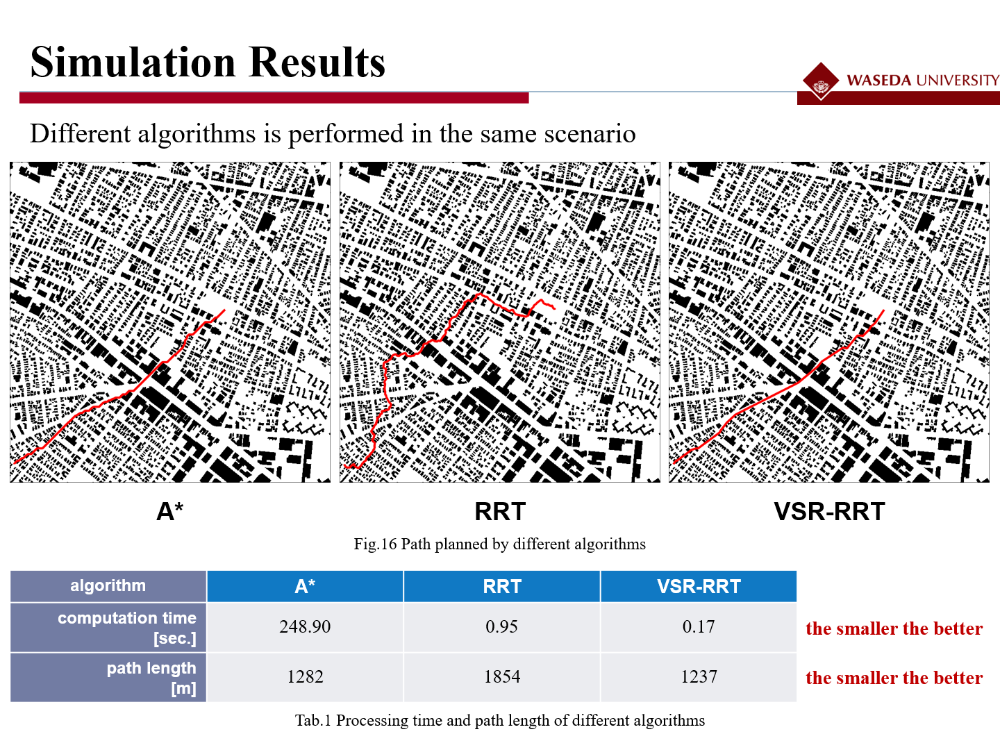

# VSR-RRT (Variable Sampling Region RRT)
RRT based path planning

In recent decades, natural disasters such as earthquakes, tsunamis, and floods have been occurring more and more frequently in the world. To reduce human casualties and property losses during these disasters, this research is focused on quickly planning a short evacuation route for fast and convenient navigation in urban environments in emergencies.

A general grid-based path planning algorithm called A* can find the theoretical shortest path, however, its performance in terms of computational speed is far from good enough when it is used in big maps like satellite images. A sampling-based path planning algorithm called RRT can find a path in a much shorter time, but the computation time would increase significantly in an environment with narrow passages. In addition, in a complex environment, the paths found by the RRT algorithm may be much longer than the shortest path, so it cannot provide convenient navigation. To solve the above problems, an improved algorithm called VSR-RRT (Variable Sampling Region-RRT) is proposed to solve the above problems. According to the simulation results of six cases on three maps, VSR-RRT requires less than 0.1% of the computation time of A*, and the computation time is reduced by at least 57% compared with traditional RRT, while the length of the path obtained is very close to (no longer than 3%) and even shorter than that of A* and much shorter than that of traditional RRT.

Firstly, this research proposes the VSR-RRT algorithm that uses an approach to flexibly adjust the sampling region. The principle is, when a new node obtained in the sampling procedure is unavailable because of obstacle blockage, VSR-RRT restricts the sampling region to an area centered on this new node instead of the whole map. This approach significantly increases the probability of a new node being placed on a narrow passage located within the sampling region, thus reducing invalid executions of the sampling procedure and reducing computation time.

Secondly, the approach of adjusting the sampling region is combined with an approach that sampling the goal to further reduce computation time and path length. This algorithm adjusts the sampling region only when an unavailable node is obtained, otherwise sampling the goal.

Thirdly, a path smoothing method is proposed to get a shorter and smoother path by removing the redundant nodes on a path. If a line connecting two nodes does not pass through any obstacle, all the nodes between these two nodes will be redundant. The greedy algorithm is used to iterate over all the nodes on the path to check if they are redundant.

The maps used in simulation are from Massachusetts Buildings Dataset provided by University of Toronto, which contains aerial images of Boston City to aid machine learning for aerial image labeling. https://www.kaggle.com/datasets/balraj98/massachusetts-buildings-dataset

The simulation is implemented in Matlab (R2020a), on the laptop with a CPU of Intel Corei7-9750H @ 2.60GHz and 32GB memory. The step size is set to 5 in RRT and Goal-biased RRT algorithms because this step size performs best in terms of computational speed among all the tests with different step sizes; similarly, the default step size for VSR-RRT, which is used to sample on the full map, is also set as 5, and it will change the step size to 2 to obtain better path finding ability in narrow passages when collisions are detected and need to be resampled at local locations.

